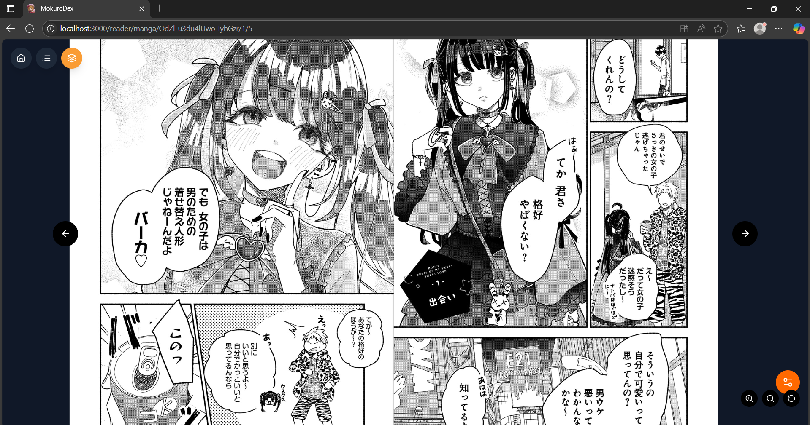
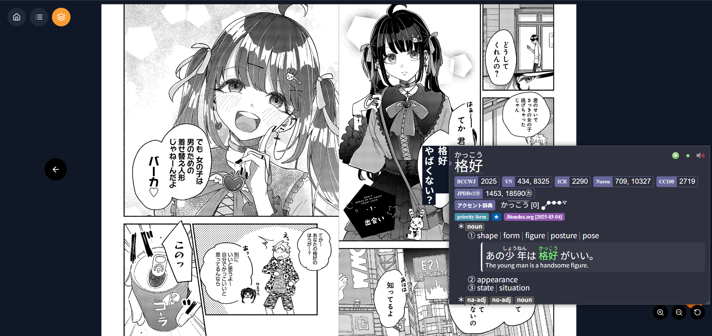
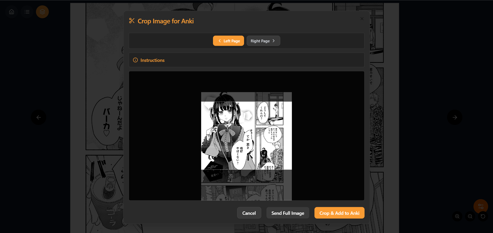
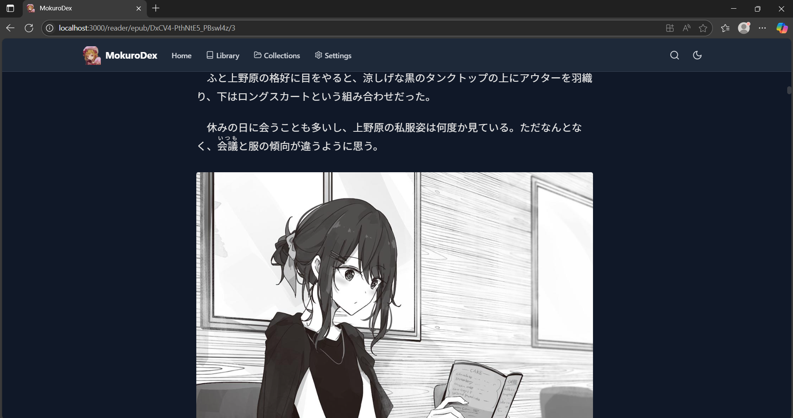
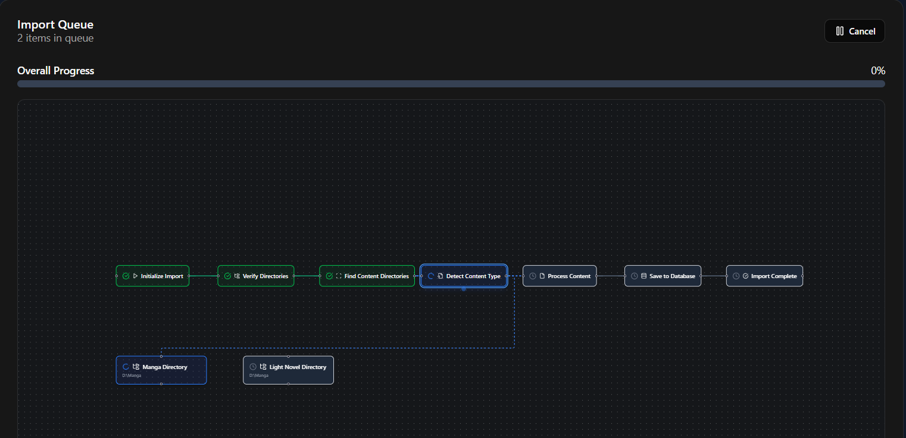

# MokuroDex

<div align="center">
  
  <h3>Self-hosted manga and Epub reader with Anki integration</h3>
  
  [](https://opensource.org/licenses/MIT)
  [](https://github.com/tranhuy105/mokurodex/stargazers)
  [](https://github.com/tranhuy105/mokurodex/issues)
  [](https://github.com/tranhuy105/mokurodex/pulls)
  [](https://github.com/tranhuy105/mokurodex/blob/main/CONTRIBUTING.md)
  
</div>

## Features

### Manga Reader


- Multiple reading modes: Single Page, Double Page, Long Strip
- Interactive text with Mokuro integration
- Anki card creation from selected text
- Image cropping and zoom tools
- Reading progress tracking





### EPUB Reader


- Distraction-free reading experience
- Automatic bookmarks and progress saving
- Customizable fonts and themes
- Dark mode support

### Universal Features
- Library management and organization
- Reading history across devices
- Responsive design for mobile/desktop
- Multi-device sync

## Quick Start

```bash
git clone https://github.com/yourusername/mokurodex.git
cd mokurodex
npm install
npm run dev
# Open http://localhost:3000
```

## Library Setup

Expected directory structure:
```
YourLibrary/
├── manga/
│   ├── SeriesName/
│   │   ├── Volume_01/
│   │   └── volume01.mokuro
└── ln/
    └── SeriesName/
        └── volume01.epub
```

### Import Process

1. Go to Import section
2. Enter your library directory path  
3. Click "Scan Directory"
4. Click "Start Import"



## Mobile Access

### Setting Up Static IP (Recommended)

Since DHCP assigns random IPs that change, set a static IP for consistent access:

**Router Configuration**:
1. Access your router admin panel (usually `192.168.1.1` or `192.168.0.1`)
2. Find "DHCP Reservation" or "Static IP" settings
3. Add your server's MAC address and assign a fixed IP (e.g., `192.168.1.200`)
4. Save and restart router

**Alternative - Server Side**:
Configure static IP directly on your server through network settings.

### Finding Current IP (If Not Using Static)

**Windows**: `ipconfig` in Command Prompt
**Mac/Linux**: `ifconfig` or `ip addr` in Terminal

### Connecting
1. Open browser on mobile device
2. Go to `http://YOUR-SERVER-IP:3000`
3. Bookmark for easy access
4. Add to home screen for app-like experience

**Note**: Server and mobile must be on same network. With static IP, the address stays consistent across reboots.

## Prerequisites

- Node.js 16+
- Manga processed with [Mokuro](https://github.com/kha-white/mokuro)
- EPUB files for light novels

## License

MIT License