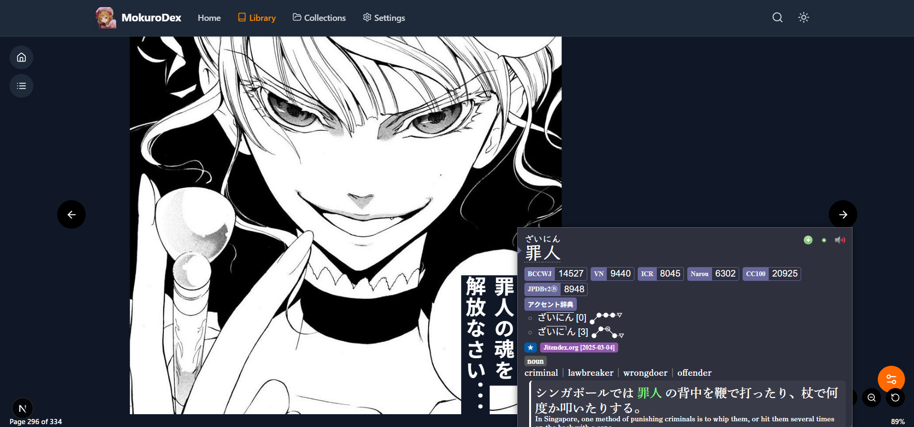
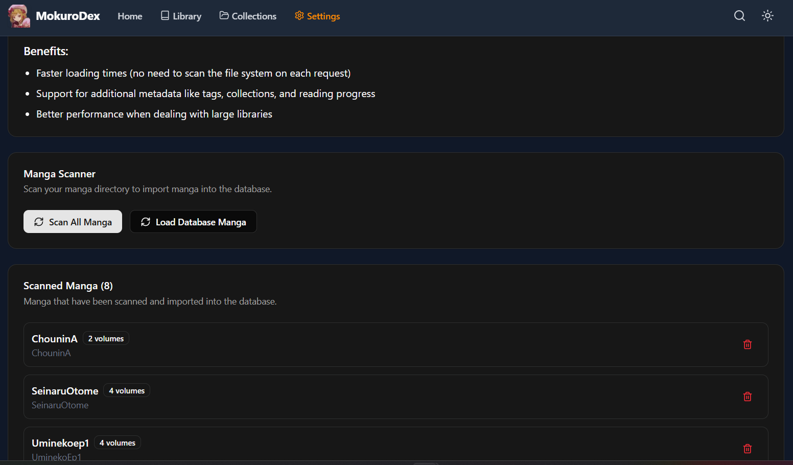

# MokuroDex

<div align="center">
  
  <h3>Self-hosted Mokuro-processed manga reader with Anki integration</h3>
  
  [](https://opensource.org/licenses/MIT)
  [](https://github.com/tranhuy105/mokurodex/stargazers)
  [](https://github.com/tranhuy105/mokurodex/issues)
  [](https://github.com/tranhuy105/mokurodex/pulls)
  [](https://github.com/tranhuy105/mokurodex/blob/main/CONTRIBUTING.md)
  
</div>

## 📖 Overview

MokuroDex is a **self-hosted manga server** (similar to Jellyfin) for reading [Mokuro](https://github.com/kha-white/mokuro)-processed manga on your **local network**. It features a modern UI and powerful Anki integration for Japanese language learners.

<div align="center">
  
  <p><i>Read manga and study vocabulary simultaneously</i></p>
</div>

## 🎯 Language Learning Integration

MokuroDex was built with Japanese language learners in mind:

- **Interactive text** - Hover over Japanese text (or tap on mobile) to display a text box
- **Yomichan-able** - Look up words directly on the page
- **Anki integration** - Add vocabulary to Anki with one click
- **Advanced image handling:**
  - Add the full manga page to your Anki cards
  - Use the built-in cropping tool to select and add just a specific panel
  - Save context for later review

## 🚀 Quick Start

### Prerequisites

- [Node.js](https://nodejs.org/) (v16 or later)
- [npm](https://www.npmjs.com/) (v7 or later)
- Mokuro-processed manga files

### Installation

```bash
# Clone the repository
git clone https://github.com/tranhuy105/mokurodex.git

# Navigate to project directory
cd mokurodex

# Install dependencies
npm install

# Start the development server
npm run dev

# Access MokuroDex in your browser
http://localhost:3000
```

## 📂 Manga Directory Structure

MokuroDex requires a specific directory structure to properly index and serve your manga:

```
public/MANGA/
  ├── One Piece/              # Manga title
  │   ├── Volume 01/          # Volume name
  │   │   ├── 001.jpg         # Mokuro-processed images
  │   │   ├── 002.jpg
  │   │   └── ...
  │   ├── volume.mokuro       # Mokuro metadata file
  │   └── ...
  └── Naruto/                 # Another manga title
      └── ...
```

### Library Scanning

**After adding or updating manga files, you must scan your library:**

1. Navigate to **Settings → Import → Scan Library**
2. Wait for the scan to complete

<div align="center">
  
  <p><i>The library scanning process indexes your manga collection</i></p>
</div>

## 📱 Mobile Usage Setup

To use MokuroDex on mobile devices with Anki integration:

### Anki Configuration (Computer)

1. Install [Anki](https://apps.ankiweb.net/)
2. Install the [AnkiConnect](https://ankiweb.net/shared/info/2055492159) add-on
3. Configure AnkiConnect:
   - In Anki: Tools → Add-ons → AnkiConnect → Config
   - Update the configuration:
   ```json
   {
     "webBindAddress": "0.0.0.0",
     "webCorsOriginList": ["*"]
   }
   ```
4. Restart Anki

### Network Configuration (Recommended)

For consistent access across devices:

- Configure a static IP for your server through DHCP reservation
- Example router access: http://192.168.0.1 or http://192.168.1.1
- Assign your computer a fixed IP (e.g., 192.168.1.100)

### Mobile Device Setup

1. Install Yomichan on your mobile browser
2. Access MokuroDex at `http://[your-server-ip]:3000`

## 📄 License

This project is licensed under the MIT License - see the [LICENSE](LICENSE) file for details.

## 🙏 Acknowledgments

- [Mokuro](https://github.com/kha-white/mokuro) for the manga OCR processing
- [Yomichan](https://foosoft.net/projects/yomichan/) for Japanese language support
- [Anki](https://apps.ankiweb.net/) and [AnkiConnect](https://ankiweb.net/shared/info/2055492159)
